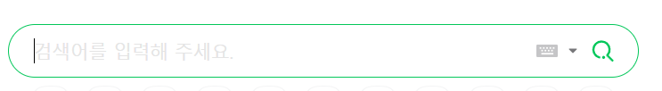
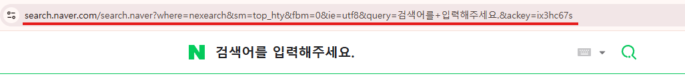

[selenium으로 네이버 접속](./2024-01-01-selenium-naver-access.md) 에서 네이버에 접속하였으며, 이 드라이버로 네이버에서 검색을 할 수 있음

## 1안. send_key를 통한 검색

selenium을 통해 생성된 드라이버에는 url변경, 요소에 입력 전송을 하는 동작이 가능하다.

send_key는 요소에 입력 전송을 하는 동작을 수행한다.

send_key는 driver에서는 사용할 수 없으며, 요소를 찾아야한다.
driver.find_element와 By를 사용하여 요소를 먼저 찾는다.

By는 `CSS_SELECTOR`, `XPATH`, `TAG_NAME`, `CLASS_NAME` 등 요소의 속성 등을 통해 찾을 수 있다.
`driver.find_element(By.CSS_SELECTOR, 'input[class="class-type"]')`
검색어를 입력하는 input의 속성을 파악하여 지정하면 된다.

input의 속성은 개발자 도구를 통해서 파악해야한다.
크롬 브라우저에서 `ctrl + shift + C`를 눌러 input을 클릭하면 해당 input의 html을 확인할 수 있다.



네이버에서 위 부분을 선택하면 아래와 같은 html 코드를 알 수 있다.

```html
<input id="query" name="query" type="search" title="검색어를 입력해 주세요." placeholder="검색어를 입력해 주세요." maxlength="255" autocomplete="off" class="search_input" data-atcmp-element="" aria-controls="" aria-autocomplete="list" aria-activedescendant="">
```

위 코드를 토대로 코드에 고유한 특성을 파악하면 위 요소를 driver에서 활용할 수 있다.

필자는 주로 `class`, `id`, `placeholder`를 사용하여 css selector로 선택을 한다.

파악되는 css selector는 `input[placeholder="검색어를 입력해 주세요."]`이다.

이를 활용한 코드는 아래와 같다.

```python
from selenium import webdriver
from selenium.webdriver.common.by import By
from selenium.webdriver.common.keys import Keys

driver = webdriver.Chrome() 

driver.get("https://naver.com")

search_box = driver.find_element(By.CSS_SELECTOR, 'input[placeholder="검색어를 입력해 주세요."]')

search_box.send_keys("검색어")

search_box.send_keys(Keys.RETURN)
```

## 2안. 주소 파라미터를 통한 검색

네이버에서 검색을 하면 기존 `naver.com`에서 다른 주소로 넘어간다.



밑줄친 주소를 보면 검색어가 query 부분 파라미터에 있는 것을 확인할 수 있다.

이 파라미터를 바꾸면 다른 주소로 적용이 되므로 `driver.get` 에서 검색어를 바꿔 활용할 수 있다.

```python
from selenium import webdriver

driver = webdriver.Chrome()

keyword = "검색어"

search_url = f"https://search.naver.com/search.naver?query={keyword}"

driver.get(search_url)
```