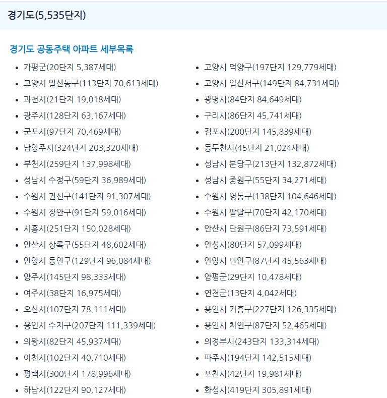
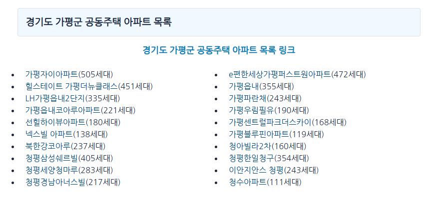
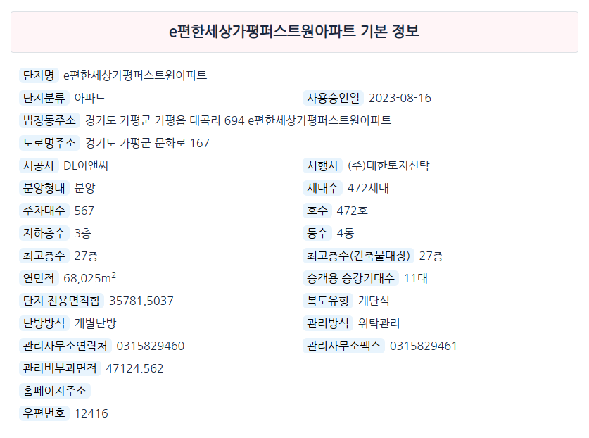

# 요청

[https://dokdokinfo.kr/housing/](https://dokdokinfo.kr/housing/) 에서 모든 지역 아파트 의 정보를 추출하여 엑셀로 저장할 것

# 분석

https://dokdokinfo.kr/housing 는 한국의 공동주택 정보를 정리해놓은 사이트로 이 사이트의 모든 정보를 엑셀화하여 요청자에게 제공하는 것이 목적임

## 수집대상

<table>
  <tbody>
    <tr>
      <td>지역</td>
      <td>단지명</td>
      <td>단지분류</td>
      <td>사용승인일</td>
      <td>법정동주소</td>
    </tr>
    <tr>
      <td>도로명주소</td>
      <td>시공사</td>
      <td>시행사</td>
      <td>분양형태</td>
      <td>세대수</td>
    </tr>
    <tr>
      <td>주차대수</td>
      <td>호수</td>
      <td>지하층수</td>
      <td>동수</td>
      <td>최고층수</td>
    </tr>
    <tr>
      <td>최고층수(건축물대장)</td>
      <td>연면적</td>
      <td>승객용 승강기대수</td>
      <td>단지 전용면적합</td>
      <td>복도형식</td>
    </tr>
    <tr>
      <td>난방방식</td>
      <td>관리방식</td>
      <td>관리사무소연락처</td>
      <td>관리사무소팩스</td>
      <td>관리비부과면적</td>
    </tr>
    <tr>
      <td>홈페이지주소</td>
      <td>우편번호</td>
      <td>60m²이하 세대수</td>
      <td>85m²이하 세대수</td>
      <td>135m²이하 세대수</td>
    </tr>
    <tr>
      <td>136m²이상 세대수</td>
      <td>주차대수</td>
      <td>전기차 충전대수</td>
      <td>버스정류장 거리</td>
      <td>지하철역명</td>
    </tr>
    <tr>
      <td>지하철역 거리</td>
      <td>주차관제.홈네트워크</td>
      <td>편의시설</td>
      <td>교육시설</td>
      <td>부대.복리시설</td>
    </tr>
    <tr>
      <td>건물구조</td>
      <td>급수방식</td>
      <td>음식물처리방법</td>
      <td>CCTV대수</td>
      <td>승강기대수</td>
    </tr>
    <tr>
      <td>수전용량</td>
      <td>세대전기계약방식</td>
      <td>승강기관리형태</td>
      <td>전기안전관리자법정선임여부</td>
      <td>화재수신방방식</td>
    </tr>
    <tr>
      <td>청소관리인원</td>
      <td>청소관리방식</td>
      <td>경비관리인원</td>
      <td>경비관리방식</td>
      <td>경비관리 계약업체</td>
    </tr>
    <tr>
      <td>소독관리방식</td>
      <td>소독방법</td>
      <td>소독관리 연간 소독횟수</td>
      <td>네이버 지도 링크</td>
      <td>카카오맵 링크</td>
    </tr>
  </tbody>
</table>
        
## 구글애드

사이트에 구글애즈가 있어 중간에 광고 팝업이 발생하여 selenium을 통해 사용하기 위해서는 광고팝업이 나타나면 닫는 로직을 추가해야함

혹은 가능하다면 selenium을 사용하지 않고 requests 를 사용할 수도 있음, 본 케이스의 경우 requests로 정보 수집이 가능하여 requests를 사용.

## 사이트 로직

https://dokdokinfo.kr/housing 에서 전체 지역의 도시별 아파트 단지수 및 세대수를 확인 할 수 있다.

전체 지역의 아파트 단지수를 확인하기 위한 a 태그의 css selector는 다음과 같이 지정할 수 있다. `a[href^="./"]`

[파란색 링크](https://dokdokinfo.kr/housingspecific/a10022657/)를 클릭하면 해당 지역의 아파트 목록을 확인할 수 있다.

해당 지역의 아파트 목록을 확인하기 위한 a 태그의 css selector는 다음과 같이 지정할 수 있다. `a[href^="./"][class*="h4"]`

[아파트 링크](https://dokdokinfo.kr/housingspecific/a10022657/)를 클릭하면 해당 아파트의 세부 정보를 확인할 수 있다.

해당 아파트의 세부 정보를 확인하기 위한 a 태그의 css selector는 다음과 같이 지정할 수 있다. `a[href^="/housingspecific/a"]`

세부정보들은 아래 css selector를 통해서 찾을 수 있다.

| 구분           | SELECTOR                       | 비고                          |
|----------------|--------------------------------|-------------------------------|
| 상세정보헤더   | span[class="custom-badge"]     |                               |
| 상세정보값     | li[class^="col"]               | 이 내용에서 헤더 내용은 제거  |
| 세대수헤더     | thead th[class^="text-"]       |                               |
| 세대수값       | tbody td[class^="text-"]       |                               |
| 네이버 지도 링크 | img[alt="네이버 지도로 연결"] | 이미지 태그의 부모 요소 href  |
| 카카오 지도 링크 | img[alt="카카오 지도로 연결"] | 이미지 태그의 부모 요소 href  |
