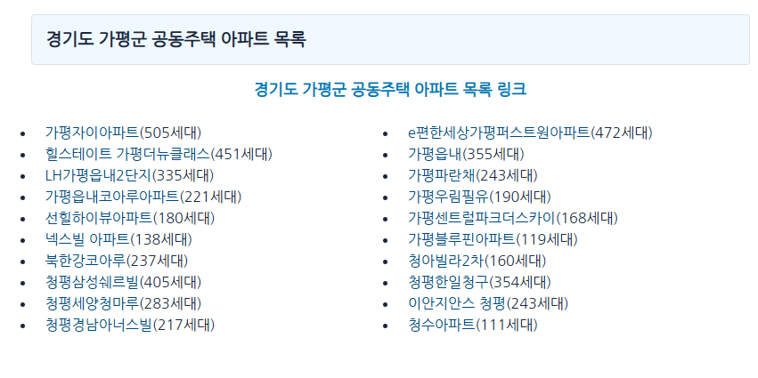

# 요청

[https://dokdokinfo.kr/housing/](https://dokdokinfo.kr/housing/) 에서 모든 지역 아파트 의 정보를 추출하여 엑셀로 저장할 것

# 분석

https://dokdokinfo.kr/housing 는 한국의 공동주택 정보를 정리해놓은 사이트로 이 사이트의 모든 정보를 엑셀화하여 요청자에게 제공하는 것이 목적임

## 수집대상

<table>
  <tbody>
    <tr>
      <td>지역</td>
      <td>단지명</td>
      <td>단지분류</td>
      <td>사용승인일</td>
      <td>법정동주소</td>
    </tr>
    <tr>
      <td>도로명주소</td>
      <td>시공사</td>
      <td>시행사</td>
      <td>분양형태</td>
      <td>세대수</td>
    </tr>
    <tr>
      <td>주차대수</td>
      <td>호수</td>
      <td>지하층수</td>
      <td>동수</td>
      <td>최고층수</td>
    </tr>
    <tr>
      <td>최고층수(건축물대장)</td>
      <td>연면적</td>
      <td>승객용 승강기대수</td>
      <td>단지 전용면적합</td>
      <td>복도형식</td>
    </tr>
    <tr>
      <td>난방방식</td>
      <td>관리방식</td>
      <td>관리사무소연락처</td>
      <td>관리사무소팩스</td>
      <td>관리비부과면적</td>
    </tr>
    <tr>
      <td>홈페이지주소</td>
      <td>우편번호</td>
      <td>60m²이하 세대수</td>
      <td>85m²이하 세대수</td>
      <td>135m²이하 세대수</td>
    </tr>
    <tr>
      <td>136m²이상 세대수</td>
      <td>주차대수</td>
      <td>전기차 충전대수</td>
      <td>버스정류장 거리</td>
      <td>지하철역명</td>
    </tr>
    <tr>
      <td>지하철역 거리</td>
      <td>주차관제.홈네트워크</td>
      <td>편의시설</td>
      <td>교육시설</td>
      <td>부대.복리시설</td>
    </tr>
    <tr>
      <td>건물구조</td>
      <td>급수방식</td>
      <td>음식물처리방법</td>
      <td>CCTV대수</td>
      <td>승강기대수</td>
    </tr>
    <tr>
      <td>수전용량</td>
      <td>세대전기계약방식</td>
      <td>승강기관리형태</td>
      <td>전기안전관리자법정선임여부</td>
      <td>화재수신방방식</td>
    </tr>
    <tr>
      <td>청소관리인원</td>
      <td>청소관리방식</td>
      <td>경비관리인원</td>
      <td>경비관리방식</td>
      <td>경비관리 계약업체</td>
    </tr>
    <tr>
      <td>소독관리방식</td>
      <td>소독방법</td>
      <td>소독관리 연간 소독횟수</td>
      <td>네이버 지도 링크</td>
      <td>카카오맵 링크</td>
    </tr>
  </tbody>
</table>
        
## 구글애드

사이트에 구글애즈가 있어 중간에 광고 팝업이 발생하여 selenium을 통해 사용하기 위해서는 광고팝업이 나타나면 닫는 로직을 추가해야함

혹은 가능하다면 selenium을 사용하지 않고 requests 를 사용할 수도 있음, 본 케이스의 경우 requests로 정보 수집이 가능하여 requests를 사용.

## 사이트 로직

https://dokdokinfo.kr/housing 에서 전체 지역의 도시별 아파트 단지수 및 세대수를 확인 할 수 있다.


전체 지역의 아파트 단지수를 확인하기 위한 a 태그의 css selector는 다음과 같이 지정할 수 있다. `a[href^="./"]`

[파란색 링크](https://dokdokinfo.kr/housingspecific/a10022657/)를 클릭하면 해당 지역의 아파트 목록을 확인할 수 있다.



해당 지역의 아파트 목록을 확인하기 위한 a 태그의 css selector는 다음과 같이 지정할 수 있다. `a[href^="./"][class*="h4"]`

[아파트 링크](https://dokdokinfo.kr/housingspecific/a10022657/)를 클릭하면 해당 아파트의 세부 정보를 확인할 수 있다.


해당 아파트의 세부 정보를 확인하기 위한 a 태그의 css selector는 다음과 같이 지정할 수 있다. `a[href^="/housingspecific/a"]`

세부정보들은 아래 css selector를 통해서 찾을 수 있다.

| 구분           | SELECTOR                       | 비고                          |
|----------------|--------------------------------|-------------------------------|
| 상세정보헤더   | span[class="custom-badge"]     |                               |
| 상세정보값     | li[class^="col"]               | 이 내용에서 헤더 내용은 제거  |
| 세대수헤더     | thead th[class^="text-"]       |                               |
| 세대수값       | tbody td[class^="text-"]       |                               |
| 네이버 지도 링크 | img[alt="네이버 지도로 연결"] | 이미지 태그의 부모 요소 href  |
| 카카오 지도 링크 | img[alt="카카오 지도로 연결"] | 이미지 태그의 부모 요소 href  |

# 코드

## 모듈 임포트

```python
import sys
import subprocess
import requests
import win32api
from win32con import MB_TOPMOST
from win32gui import GetForegroundWindow
from bs4 import BeautifulSoup
import openpyxl
from datetime import datetime
```

## 지역 별 아파트 url 수집

```python
def get_detail_urls():
    try:
        response = requests.get(url)
        response.raise_for_status()
    except Exception as e:
        el, et = error_check()
        em = f"{et} line {el}\n{e.__class__.__name__}: {e}"
        error_process(em)
        return False

    try:
        response.encoding = 'utf-8'
        soup = BeautifulSoup(response.text, 'html.parser')
        links = soup.select('a[href^="./"]')
        if not links:
            raise ValueError("(1) 메인 페이지에서 링크를 찾을 수 없습니다.")
        detail_urls = [url + links[i]['href'].lstrip('./') for i in range(len(links))]
    except Exception as e:
        el, et = error_check()
        em = f"{et} line {el}\n{e.__class__.__name__}: {e}"
        error_process(em)
        return False
    else:
        return detail_urls
```

## 아파트 목록 url 수집

```python
def get_apartment_urls(detail_url):
    try:
        response = requests.get(detail_url)
        response.raise_for_status()
    except Exception as e:
        el, et = error_check()
        em = f"{et} line {el}\n{e.__class__.__name__}: {e}"
        error_process(em)
        return False
    
    try:
        response.encoding = 'utf-8'
        soup = BeautifulSoup(response.text, 'html.parser')
        links = soup.select('a[href^="./"][class*="h4"]')
        if not links:
            raise ValueError("(2) 상세 페이지에서 아파트 링크를 찾을 수 없습니다.")
        apartment_urls = [detail_url + links[i]['href'].lstrip('./') for i in range(len(links))]
    except Exception as e:
        el, et = error_check()
        em = f"{et} line {el}\n{e.__class__.__name__}: {e}"
        error_process(em)
        return False
    else:
        return apartment_urls
```

## 아파트 별 상세 정보 url 수집

```python 
def get_apartment_detail_urls(apartment_url):
    try:
        response = requests.get(apartment_url)
        response.raise_for_status()
    except Exception as e:
        el, et = error_check()
        em = f"{et} line {el}\n{e.__class__.__name__}: {e}"
        error_process(em)
        return False
    
    try:
        response.encoding = 'utf-8'
        soup = BeautifulSoup(response.text, 'html.parser')
        links = soup.select('a[href^="/housingspecific/a"]')
        if not links:
            raise ValueError("(3) 아파트 페이지에서 상세 링크를 찾을 수 없습니다.")
        apartment_detail_urls = ['https://dokdokinfo.kr/' + links[i]['href'].lstrip('./') for i in range(len(links))]
    except Exception as e:
        el, et = error_check()
        em = f"{et} line {el}\n{e.__class__.__name__}: {e}"
        error_process(em)
        return False
    else:
        return apartment_detail_urls
```

## 아파트 상세 정보 수집

```python
def get_apartment_data(apartment_detail_url):
    try:
        response = requests.get(apartment_detail_url)
        response.raise_for_status()
    except Exception as e:
        el, et = error_check()
        em = f"{et} line {el}\n{e.__class__.__name__}: {e}"
        error_process(em)
        return False
    
    try:
        response.encoding = 'utf-8'
        soup = BeautifulSoup(response.text, 'html.parser')
        
        detail_headers = [header.get_text(strip=True) for header in soup.select(detail_header_css_selector)]
        detail_values = [value.get_text(strip=True).lstrip(header.get_text(strip=True)) for header, value in zip(soup.select(detail_header_css_selector), soup.select(detail_value_css_selector))]
        if len(detail_headers) != len(detail_values):
            raise ValueError("(4) 상세 정보의 헤더와 값의 개수가 일치하지 않습니다.")
        detail_dict = dict(zip(detail_headers, detail_values))  
        living_headers = [header.get_text(strip=True) for header in soup.select(living_header_css_selector)]
        living_values = [value.get_text(strip=True) for value in soup.select(living_value_css_selector)]
        if len(living_headers) != len(living_values):
            raise ValueError("(5) 주택 정보의 헤더와 값의 개수가 일치하지 않습니다.")
        living_dict = dict(zip(living_headers, living_values))
        naver_map_tag = soup.select_one(naver_map_url_css_selector)
        naver_map_url = naver_map_tag.parent['href'] if naver_map_tag and naver_map_tag.parent.name == 'a' else ''
        kakao_map_tag = soup.select_one(kakao_map_url_css_selector)
        kakao_map_url = kakao_map_tag.parent['href'] if kakao_map_tag and kakao_map_tag.parent.name == 'a' else ''
        combined_dict = {**detail_dict, **living_dict, "네이버 지도": naver_map_url, "카카오 지도": kakao_map_url}
        if not output_headers:
            output_headers.extend(combined_dict.keys())
        output_data.append(list(combined_dict.values()))
    except Exception as e:
        el, et = error_check()
        em = f"{et} line {el}\n{e.__class__.__name__}: {e}"
        error_process(em)
        return False
    else:
        return True
```
## 전체 코드

```python
import sys
import subprocess
import requests
import win32api
from win32con import MB_TOPMOST
from win32gui import GetForegroundWindow
from bs4 import BeautifulSoup
import openpyxl
from datetime import datetime

output_xlsx = "output.xlsx"
error_txt = "error.txt"

url = "https://dokdokinfo.kr/housing/"
detail_header_css_selector = 'span[class="custom-badge"]'
detail_value_css_selector = 'li[class^="col"]'
living_value_css_selector = 'tbody td[class^="text-"]'
living_header_css_selector = 'thead th[class^="text-"]'
naver_map_url_css_selector = 'img[alt="네이버 지도로 연결"]'
kakao_map_url_css_selector = 'img[alt="카카오 지도로 연결"]'

output_headers = []
output_data = []

def error_check():
    exc_type, exc_obj, exc_tb = sys.exc_info()
    e_T = datetime.now().strftime("%m%d %H:%M")
    return str(exc_tb.tb_lineno), e_T

def fwrite(file_path, data):
    if data[-1] != "\n":
        data += "\n"
    try:
        with open(file_path, "a", encoding="utf-8") as f:
            f.write(data)
    except Exception as e:
        with open(file_path, "a", encoding="cp949") as f:
            f.write(data)

def error_process(message):
    fwrite(error_txt, message)
    win32api.MessageBox(GetForegroundWindow(), message, "Error", MB_TOPMOST)

def get_detail_urls():
    try:
        response = requests.get(url)
        response.raise_for_status()
    except Exception as e:
        el, et = error_check()
        em = f"{et} line {el}\n{e.__class__.__name__}: {e}"
        error_process(em)
        return False

    try:
        response.encoding = 'utf-8'
        soup = BeautifulSoup(response.text, 'html.parser')
        links = soup.select('a[href^="./"]')
        if not links:
            raise ValueError("(1) 메인 페이지에서 링크를 찾을 수 없습니다.")
        detail_urls = [url + links[i]['href'].lstrip('./') for i in range(len(links))]
    except Exception as e:
        el, et = error_check()
        em = f"{et} line {el}\n{e.__class__.__name__}: {e}"
        error_process(em)
        return False
    else:
        return detail_urls
    
def get_apartment_urls(detail_url):
    try:
        response = requests.get(detail_url)
        response.raise_for_status()
    except Exception as e:
        el, et = error_check()
        em = f"{et} line {el}\n{e.__class__.__name__}: {e}"
        error_process(em)
        return False
    
    try:
        response.encoding = 'utf-8'
        soup = BeautifulSoup(response.text, 'html.parser')
        links = soup.select('a[href^="./"][class*="h4"]')
        if not links:
            raise ValueError("(2) 상세 페이지에서 아파트 링크를 찾을 수 없습니다.")
        apartment_urls = [detail_url + links[i]['href'].lstrip('./') for i in range(len(links))]
    except Exception as e:
        el, et = error_check()
        em = f"{et} line {el}\n{e.__class__.__name__}: {e}"
        error_process(em)
        return False
    else:
        return apartment_urls
    
def get_apartment_detail_urls(apartment_url):
    try:
        response = requests.get(apartment_url)
        response.raise_for_status()
    except Exception as e:
        el, et = error_check()
        em = f"{et} line {el}\n{e.__class__.__name__}: {e}"
        error_process(em)
        return False
    
    try:
        response.encoding = 'utf-8'
        soup = BeautifulSoup(response.text, 'html.parser')
        links = soup.select('a[href^="/housingspecific/a"]')
        if not links:
            raise ValueError("(3) 아파트 페이지에서 상세 링크를 찾을 수 없습니다.")
        apartment_detail_urls = ['https://dokdokinfo.kr/' + links[i]['href'].lstrip('./') for i in range(len(links))]
    except Exception as e:
        el, et = error_check()
        em = f"{et} line {el}\n{e.__class__.__name__}: {e}"
        error_process(em)
        return False
    else:
        return apartment_detail_urls
    
def get_apartment_data(apartment_detail_url):
    try:
        response = requests.get(apartment_detail_url)
        response.raise_for_status()
    except Exception as e:
        el, et = error_check()
        em = f"{et} line {el}\n{e.__class__.__name__}: {e}"
        error_process(em)
        return False
    
    try:
        response.encoding = 'utf-8'
        soup = BeautifulSoup(response.text, 'html.parser')
        
        detail_headers = [header.get_text(strip=True) for header in soup.select(detail_header_css_selector)]
        detail_values = [value.get_text(strip=True).lstrip(header.get_text(strip=True)) for header, value in zip(soup.select(detail_header_css_selector), soup.select(detail_value_css_selector))]
        if len(detail_headers) != len(detail_values):
            raise ValueError("(4) 상세 정보의 헤더와 값의 개수가 일치하지 않습니다.")
        detail_dict = dict(zip(detail_headers, detail_values))  
        living_headers = [header.get_text(strip=True) for header in soup.select(living_header_css_selector)]
        living_values = [value.get_text(strip=True) for value in soup.select(living_value_css_selector)]
        if len(living_headers) != len(living_values):
            raise ValueError("(5) 주택 정보의 헤더와 값의 개수가 일치하지 않습니다.")
        living_dict = dict(zip(living_headers, living_values))
        naver_map_tag = soup.select_one(naver_map_url_css_selector)
        naver_map_url = naver_map_tag.parent['href'] if naver_map_tag and naver_map_tag.parent.name == 'a' else ''
        kakao_map_tag = soup.select_one(kakao_map_url_css_selector)
        kakao_map_url = kakao_map_tag.parent['href'] if kakao_map_tag and kakao_map_tag.parent.name == 'a' else ''
        combined_dict = {**detail_dict, **living_dict, "네이버 지도": naver_map_url, "카카오 지도": kakao_map_url}
        if not output_headers:
            output_headers.extend(combined_dict.keys())
        output_data.append(list(combined_dict.values()))
    except Exception as e:
        el, et = error_check()
        em = f"{et} line {el}\n{e.__class__.__name__}: {e}"
        error_process(em)
        return False
    else:
        return True
    
def main():
    try:
        wb = openpyxl.Workbook()
        ws = wb.active
        ws.append(["데이터 수집 중..."])
        wb.save(output_xlsx)
    except Exception as e:
        el, et = error_check()
        em = f"{et} line {el}\n{e.__class__.__name__}: {e}"
        error_process(em)
        return
    
    detail_urls = get_detail_urls()
    if not detail_urls:
        return
    total_cnt = len(detail_urls)
    for seq, detail_url in enumerate(detail_urls, start=1):
        print(f"[{seq}/{total_cnt}] {detail_url} 정보 수집 중...")
        apartment_urls = get_apartment_urls(detail_url)
        if not apartment_urls:
            break

        total_apartment_cnt = len(apartment_urls)
        for apartment_url in apartment_urls:
            print(f"  [{seq}/{total_cnt}] [{apartment_urls.index(apartment_url)+1}/{total_apartment_cnt}] {apartment_url} 상세 정보 수집 중...")
            apartment_detail_urls = get_apartment_detail_urls(apartment_url)
            if not apartment_detail_urls:
                break
            
            total_apartment_detail_cnt = len(apartment_detail_urls)
            for apartment_detail_url in apartment_detail_urls:
                print(f"    [{seq}/{total_cnt}] [{apartment_urls.index(apartment_url)+1}/{total_apartment_cnt}] [{apartment_detail_urls.index(apartment_detail_url)+1}/{total_apartment_detail_cnt}] {apartment_detail_url} 데이터 수집 중...")
                success = get_apartment_data(apartment_detail_url)
                if not success:
                    break

    if output_data:
        try:
            wb = openpyxl.Workbook()
            ws = wb.active
            ws.append(output_headers)
            for data_row in output_data:
                ws.append(data_row)
            wb.save(output_xlsx)
            print(f"데이터가 '{output_xlsx}' 파일에 저장되었습니다.")
        except Exception as e:
            el, et = error_check()
            em = f"{et} line {el}\n{e.__class__.__name__}: {e}"
            error_process(em)
    else:
        print("수집된 데이터가 없습니다.")

if __name__ == "__main__":
    main()
```